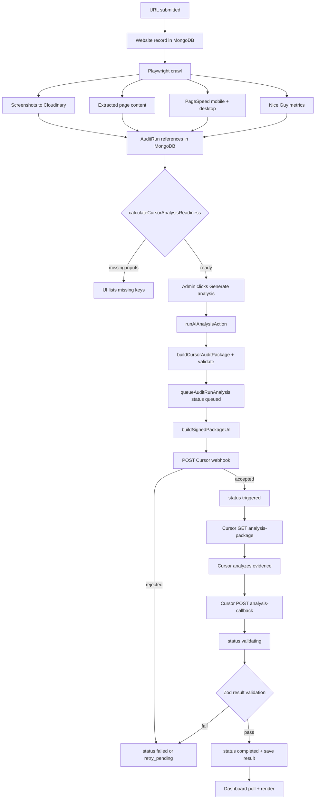
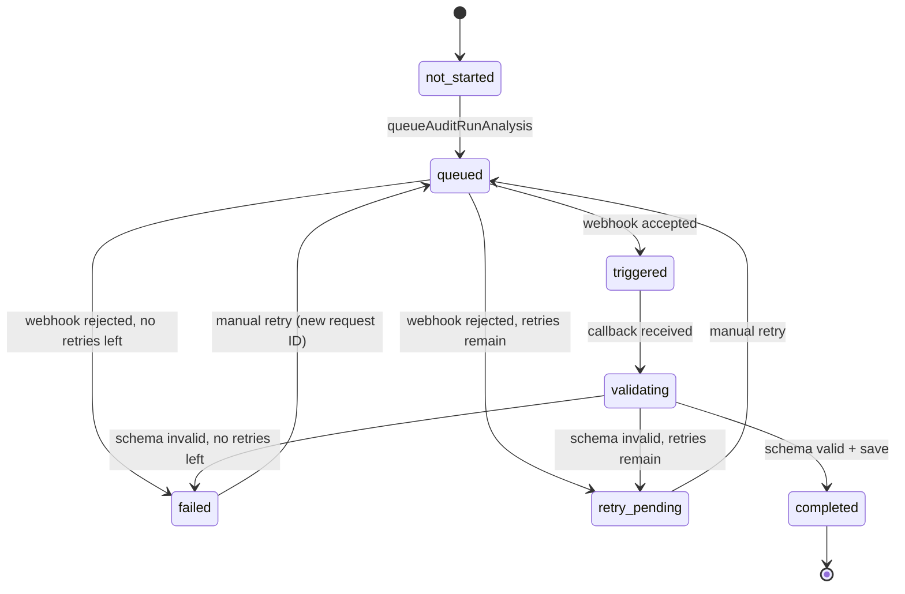

# Cursor Automation Website Audit Analysis

> **Contract version 1.1** — Package and callback schemas updated. AI assessment is separate from the official Nice Guy Metrics score. See [Environment variables](#environment-variables) and [Stale analysis recovery](#stale-analysis-recovery).

This document describes the **implemented** Cursor Automation proof-of-concept for AI website audit analysis on the `audittool` branch. It is based on the current code in this repository, not on planned behavior.

**Related files:**

- Agent contract and instructions: [`audit-agent/README.md`](../audit-agent/README.md)
- Package JSON schema: [`audit-agent/audit-package.schema.json`](../audit-agent/audit-package.schema.json)
- Result JSON schema: [`audit-agent/audit-result.schema.json`](../audit-agent/audit-result.schema.json)
- Agent prompt to paste into Cursor: [`audit-agent/analysis-instructions.md`](../audit-agent/analysis-instructions.md) — section **“Copy into Cursor Automation prompt field”**

---

## 1. Purpose

### Why Cursor Automation for this POC

The application already collects rich audit evidence (Playwright crawl, PageSpeed, Nice Guy metrics, Cloudinary screenshots). For this proof of concept, **Cursor Automation acts as an asynchronous analysis worker** instead of calling OpenAI synchronously from the application server.

This lets the team:

- Validate the audit package contract and callback flow before committing to a direct AI provider integration.
- Run analysis in Cursor’s cloud agent environment with access to the normalized package over HTTPS.
- Keep the existing collection pipeline unchanged.

### What Cursor is responsible for

When `AI_ANALYSIS_PROVIDER=cursor-automation`:

1. Receive a small authenticated webhook payload.
2. Fetch the full audit package from a signed, expiring URL.
3. Analyze the supplied evidence (screenshots, metrics, crawl, content).
4. POST a structured JSON result to the application callback endpoint.

Cursor is **not** given MongoDB credentials, application secrets (beyond what the operator configures in Cursor secrets for the callback header), or raw database documents.

### What the Nice Guy application is responsible for

1. Website URL intake and audit record management.
2. Playwright crawl, PageSpeed, Nice Guy scoring, and screenshot capture.
3. Readiness validation before triggering analysis.
4. Building and validating the normalized audit package.
5. Issuing signed package URLs.
6. Triggering the Cursor webhook from the server.
7. Authenticating and validating callback results.
8. Persisting analysis state and results on the `AuditRun` document.
9. Dashboard display, polling, and retry controls.

### Replacing Cursor with OpenAI later

The design keeps provider-specific logic behind a small interface. When `AI_ANALYSIS_PROVIDER` is not `cursor-automation`, the existing synchronous path in [`src/services/run-ai-analysis.ts`](../src/services/run-ai-analysis.ts) runs unchanged via [`src/actions/ai.ts`](../src/actions/ai.ts).

These parts are **provider-agnostic** and would remain the same with a future direct OpenAI provider:

- Audit collection (crawl, PageSpeed, Nice Guy, screenshots)
- `calculateCursorAnalysisReadiness()` (could be renamed; logic is evidence-based)
- `buildCursorAuditPackage()` and package/result Zod schemas
- `AuditRun.analysis` storage and dashboard result rendering
- Callback validation patterns (a direct provider might write results inline instead of using HTTP callback)

Only the **analysis provider implementation** changes: [`src/services/cursor-analysis/providers/`](../src/services/cursor-analysis/providers/).

---

## 2. End-to-end flow

### Narrative (implemented path)

1. **URL submission**
   - Public: [`/work/website-audit`](../app/(main)/work/website-audit/page.tsx) → `submitPublicAuditRequestAction` in [`src/actions/public-audit-request.ts`](../src/actions/public-audit-request.ts) → `createWebsite()`.
   - Admin: [`/dashboard/websites/new`](../app/dashboard/websites/new/page.tsx) → website CRUD actions.

2. **Evidence collection** (manual stage buttons on [`/dashboard/websites/[id]`](../app/dashboard/websites/[id]/page.tsx))
   - **Playwright crawl** — `RunCrawlButton` → admin crawl API.
   - **Screenshots** — captured during crawl pipeline, stored in MongoDB, images on **Cloudinary** (`secureUrl` / `publicUrl`).
   - **Google PageSpeed** — mobile and desktop via `RunPageSpeedButton`.
   - **Nice Guy metrics** — via `RunNiceGuyAnalysisButton`.

3. **MongoDB** stores website, crawl, screenshots, Google metrics, Nice Guy metrics, and `AuditRun` records with references to those artifacts.

4. **Readiness** — `calculateCursorAnalysisReadiness()` runs on the server when building the dashboard and again when analysis is requested.

5. **Generate analysis** — administrator clicks the button in [`RunAiAnalysisButton`](../components/websiteAudit/RunAiAnalysisButton.tsx) → `runAiAnalysisAction()` → `requestCursorAnalysisForAuditRun()`.

6. **Package** — `buildCursorAuditPackage()` normalizes audit-run resources into the contract shape and validates with Zod.

7. **Signed URL** — `buildSignedPackageUrl()` creates `GET /api/audits/:auditId/analysis-package?token=...`.

8. **Cursor webhook** — `CursorAutomationAnalysisProvider.requestAnalysis()` POSTs a small JSON payload.

9. **Cursor analysis** — agent fetches package, analyzes evidence, POSTs result to callback. *(Requires manual Cursor Automation configuration; not verified automatically in CI.)*

10. **Callback** — `POST /api/audits/:auditId/analysis-callback` → `handleCursorAnalysisCallback()`.

11. **Validation & save** — Zod validation, sanitization, `completeAuditRunAnalysis()` writes to `AuditRun.analysis.result`.

12. **Dashboard** — page revalidates; [`CursorAnalysisStatusPoller`](../components/audit-dashboard/cursor-analysis-status-poller.tsx) polls until terminal state; [`CursorAnalysisResultsPanel`](../components/audit-dashboard/cursor-analysis-results-panel.tsx) renders the result.

> **Important:** Webhook acceptance (`triggered` status) does **not** mean analysis is complete. The callback is the authoritative completion event.

### Flowchart



---

## 3. Responsibility boundaries

| Responsibility | Owner |
|----------------|-------|
| URL form, Generate button, status display, polling | **Frontend** (`components/websiteAudit/*`, `components/audit-dashboard/*`) |
| Readiness, package build, token signing, webhook client, callback handler, server actions | **Application backend** (`src/services/cursor-analysis/*`, `src/actions/ai.ts`, API routes) |
| Websites, crawls, metrics, screenshots, `AuditRun.analysis` | **MongoDB** (via Mongoose models in `src/models/`) |
| Screenshot image hosting (HTTPS URLs in package) | **Cloudinary** |
| Fetch package, run analysis, POST callback | **Cursor Automation** (external worker) |
| Synchronous OpenAI analysis when provider ≠ cursor | **Future / current OpenAI path** — [`src/services/run-ai-analysis.ts`](../src/services/run-ai-analysis.ts) |

**Cursor does not receive MongoDB credentials.** It only receives:

- A signed HTTPS `packageUrl` (read-only, time-limited, bound to `auditId` + `analysisRequestId`).
- A `callbackUrl` and the **name** of the callback header (not the secret value in the webhook body).
- Public Cloudinary screenshot URLs inside the package.

---

## 4. Audit readiness

### Required inputs

`calculateCursorAnalysisReadiness()` in [`src/services/cursor-analysis/readiness.ts`](../src/services/cursor-analysis/readiness.ts) checks:

| Requirement | Implementation detail | Missing key |
|-------------|----------------------|-------------|
| Valid audit ID | `input.auditId` truthy | `auditId` |
| Completed crawl | `crawl.status === "complete"` | `crawl` |
| Extracted homepage content | title, meta, visible text, or headings on home page | `crawl.content` |
| Desktop screenshot | `status === "complete"`, type `desktop-viewport` or `desktop-full`, HTTPS URL | `screenshots.desktop` |
| Mobile screenshot | `status === "complete"`, type `mobile-viewport` or `mobile-full`, HTTPS URL | `screenshots.mobile` |
| PageSpeed mobile | `pageSpeed.mobile.status === "complete"` | `googleMetrics.mobile` |
| PageSpeed desktop | `pageSpeed.desktop.status === "complete"` | `googleMetrics.desktop` |
| Nice Guy metrics | `niceGuy.status === "complete"` | `niceGuyMetrics` |
| Screenshot crawl match | all screenshots `crawlId === crawl.id` | `screenshots.crawlMatch` |
| PageSpeed crawl match | mobile/desktop `crawlId === crawl.id` | `googleMetrics.mobile.crawlMatch`, `googleMetrics.desktop.crawlMatch` |
| Nice Guy crawl match | `niceGuy.crawlId === crawl.id` | `niceGuyMetrics.crawlMatch` |
| Valid screenshot URLs | all screenshots must have `https:` URLs | `screenshots.url` |

Screenshot URL fields checked: `secureUrl`, `publicUrl`.

### Where readiness is used

| Location | Purpose |
|----------|---------|
| [`src/services/get-website-audit-dashboard.ts`](../src/services/get-website-audit-dashboard.ts) | Computes `cursorAnalysisReadiness` for the dashboard (uses audit-run-scoped resources when `selectedAuditRunId` is set) |
| [`src/services/cursor-analysis/request-cursor-analysis.ts`](../src/services/cursor-analysis/request-cursor-analysis.ts) | Re-checks before trigger; returns `AUDIT_NOT_READY` with `missing` array |
| [`loadCursorAuditPackageForToken()`](../src/services/cursor-analysis/request-cursor-analysis.ts) | Re-checks before serving package (returns `null` → 404) |

### UI when data is missing

[`RunAiAnalysisButton`](../components/websiteAudit/RunAiAnalysisButton.tsx):

- Disables the button when `!cursorReadiness.ready` (Cursor mode) or `!prerequisitesMet` (OpenAI mode).
- Renders a bullet list under **“Missing inputs for Cursor analysis:”** with each string from `cursorReadiness.missing`.

### Why server re-checks

Client-side readiness is for UX only. `requestCursorAnalysisForAuditRun()` always calls `calculateCursorAnalysisReadiness()` again before queueing. The package endpoint also re-validates via `loadCursorAuditPackageForToken()`.

---

## 5. Audit package

### Package builder

**File:** [`src/services/cursor-analysis/build-cursor-audit-package.ts`](../src/services/cursor-analysis/build-cursor-audit-package.ts)  
**Function:** `buildCursorAuditPackage()`

Called from:

- `requestCursorAnalysisForAuditRun()` (pre-trigger validation)
- `loadCursorAuditPackageForToken()` (package endpoint response)

### Purpose of normalization

Cursor receives a **stable contract** (`auditId`, `website`, `screenshots`, `googleMetrics`, `niceGuyMetrics`, `crawl`, etc.) instead of raw Mongoose documents. Internal IDs, stale fields, and oversized content are trimmed or mapped.

### Schema locations

| Format | Path |
|--------|------|
| JSON Schema | [`audit-agent/audit-package.schema.json`](../audit-agent/audit-package.schema.json) |
| Runtime Zod | [`src/services/cursor-analysis/schemas.ts`](../src/services/cursor-analysis/schemas.ts) — `cursorAuditPackageSchema`, `validateCursorAuditPackage()` |
| Example fixture | [`audit-agent/examples/example-package.json`](../audit-agent/examples/example-package.json) |

### Included information

- `schemaVersion`, `auditId` (equals `auditRunId`)
- `website`: `url`, `businessName`, `industry`, `pagesAnalyzed`
- `screenshots[]`: `id`, `page`, `device`, `url`, `width`, `height`, `capturedAt`
- `googleMetrics.mobile` / `desktop`: normalized PageSpeed fields (scores, lab metrics, opportunities, etc.)
- `niceGuyMetrics`: status, scoring version, overall score, categories
- `crawl`: status, URLs, page results (truncated `visibleText`, limited arrays)
- `requestedOutputs`: executive summary, strengths, issues, hero, outreach email
- `metadata.packageCreatedAt`, `metadata.packageVersion`

### Intentionally excluded

- MongoDB connection strings or credentials
- Environment variables and internal secrets
- Authentication cookies
- Raw base64 screenshot data
- Full unfiltered database documents
- Internal worker logs

### Screenshot representation

Complete screenshots from the audit run are mapped to:

```json
{
  "id": "shot_desktop_home",
  "page": "home",
  "device": "desktop",
  "url": "https://res.cloudinary.com/example/image/upload/v1/example-desktop.png",
  "width": 1440,
  "height": 1000,
  "capturedAt": "2026-08-01T12:00:00.000Z"
}
```

- `device` is derived from screenshot `type` (`desktop-*` → `desktop`, `mobile-*` → `mobile`).
- `url` is `secureUrl` or `publicUrl` (must be HTTPS for readiness).

### Package validation

`buildCursorAuditPackage()` constructs the object, then calls `validateCursorAuditPackage()` (Zod). Invalid packages throw before trigger or return 404 from the package endpoint.

### Shortened example

```json
{
  "schemaVersion": "1.0",
  "auditId": "674a1b2c3d4e5f6789012345",
  "website": {
    "url": "https://example.com",
    "businessName": "Example Business",
    "industry": "Home services",
    "pagesAnalyzed": ["https://example.com/"]
  },
  "screenshots": [
    {
      "id": "shot_desktop_home",
      "page": "home",
      "device": "desktop",
      "url": "https://res.cloudinary.com/demo/image/upload/v1/example-desktop.png",
      "width": 1440,
      "height": 1000,
      "capturedAt": "2026-08-01T12:00:00.000Z"
    }
  ],
  "googleMetrics": { "mobile": { "status": "complete", "scores": {} }, "desktop": {} },
  "niceGuyMetrics": { "status": "complete", "overallScore": 72 },
  "crawl": { "status": "complete", "pageResults": [] },
  "requestedOutputs": ["executive_summary", "strengths", "prioritized_issues", "hero_recommendations", "outreach_email"],
  "metadata": {
    "packageCreatedAt": "2026-08-01T12:00:00.000Z",
    "packageVersion": "1.0"
  }
}
```

---

## 6. Signed package URL

### Endpoint

| Property | Value |
|----------|-------|
| Path | `GET /api/audits/[auditId]/analysis-package` |
| File | [`app/api/audits/[auditId]/analysis-package/route.ts`](../app/api/audits/[auditId]/analysis-package/route.ts) |
| Auth | Query parameter `token` (HMAC-signed) |
| Middleware | **Not** behind admin session middleware (public route with token auth) |

### Token format (conceptual)

`{base64url-encoded-json-payload}.{hmac-sha256-signature-base64url}`

Payload fields (`AuditPackageTokenPayload` in [`package-token.ts`](../src/services/cursor-analysis/package-token.ts)):

- `auditId`
- `analysisRequestId`
- `expiresAt` (Unix ms timestamp)

### Signing

- Algorithm: HMAC-SHA256
- Secret: `AUDIT_PACKAGE_SIGNING_SECRET` (server-only)
- Comparison: `timingSafeEqual` on signature

### Expiration

- Default TTL: **60 minutes** (`AUDIT_PACKAGE_TOKEN_TTL_MS` in [`config.ts`](../src/services/cursor-analysis/config.ts))

### Audit-ID binding

`verifyAuditPackageToken(token, expectedAuditId)` rejects tokens whose payload `auditId` does not match the route `:auditId`.

The token is also bound to `analysisRequestId`; `loadCursorAuditPackageForToken()` requires the current `AuditRun.analysis.analysisRequestId` to match.

### Error responses

| Condition | HTTP | Code |
|-----------|------|------|
| Missing `token` query param | 401 | `UNAUTHORIZED` |
| Invalid / tampered / expired token | 401 | `UNAUTHORIZED` |
| Token `auditId` mismatch | 403 | `UNAUTHORIZED` (message: invalid or expired) |
| Audit incomplete or request ID mismatch | 404 | `NOT_FOUND` |

### Why raw MongoDB documents are not returned

The route returns `{ success: true, package: <validated CursorAuditPackage> }` only. This limits exposure if a token leaks and keeps the Cursor agent independent of internal schema.

---

## 7. Cursor Automation trigger

### Route invoked by Generate analysis

The dashboard button does **not** call the REST API directly from the browser. It uses the server action:

| Step | Component |
|------|-----------|
| UI click | [`RunAiAnalysisButton`](../components/websiteAudit/RunAiAnalysisButton.tsx) |
| Server action | [`runAiAnalysisAction()`](../src/actions/ai.ts) |
| Orchestration | [`requestCursorAnalysisForAuditRun()`](../src/services/cursor-analysis/request-cursor-analysis.ts) |

A parallel admin REST endpoint also exists for status and programmatic trigger:

- `POST /api/admin/audit-runs/[auditRunId]/analysis` — [`app/api/admin/audit-runs/[auditRunId]/analysis/route.ts`](../app/api/admin/audit-runs/[auditRunId]/analysis/route.ts)
- Requires administrator session (or internal worker secret for `/api/admin/*` per middleware)
- Rate limited via `enforceAdministratorActionRateLimit` with policy `ai-analysis-run`

### Cursor webhook client

**Class:** `CursorAutomationAnalysisProvider` in [`src/services/cursor-analysis/providers/cursor-automation-provider.ts`](../src/services/cursor-analysis/providers/cursor-automation-provider.ts)  
**Factory:** `getAuditAnalysisProvider()` in [`get-analysis-provider.ts`](../src/services/cursor-analysis/providers/get-analysis-provider.ts)

### Trigger payload (sanitized example)

```json
{
  "event": "audit.ready_for_analysis",
  "schemaVersion": "1.0",
  "auditId": "674a1b2c3d4e5f6789012345",
  "analysisRequestId": "f47ac10b-58cc-4372-a567-0e02b2c3d479",
  "packageUrl": "https://your-app.example/api/audits/674a1b2c3d4e5f6789012345/analysis-package?token=...",
  "callbackUrl": "https://your-app.example/api/audits/674a1b2c3d4e5f6789012345/analysis-callback",
  "callbackAuthHeader": "x-cursor-callback-secret",
  "callbackAuthToken": "<short-lived-signed-token>"
}
```

The permanent `CURSOR_ANALYSIS_CALLBACK_SECRET` stays on the application server. Each trigger generates a signed `callbackAuthToken` bound to `auditId` and `analysisRequestId`. Cursor sends that token in the header named by `callbackAuthHeader`.

Constants: `CURSOR_ANALYSIS_EVENT`, `CURSOR_ANALYSIS_SCHEMA_VERSION` in [`constants.ts`](../src/services/cursor-analysis/constants.ts).

The callback **secret value is not** included in this payload.

### Authentication handling

Configurable via environment:

- `CURSOR_AUTOMATION_AUTH_HEADER` (default: `Authorization`)
- `CURSOR_AUTOMATION_AUTH_SCHEME` (default: `Bearer`)
- `CURSOR_AUTOMATION_AUTH_TOKEN`

The client sends: `{header}: {scheme} {token}` (or raw token if scheme is empty).

Use the exact header format your Cursor Automation webhook provides.

### Status changes during trigger

| Step | `AuditRun.analysis.status` | Other |
|------|------------------------------|-------|
| Duplicate active job blocked | unchanged | returns `ANALYSIS_ALREADY_ACTIVE` |
| Readiness fails | unchanged | returns `AUDIT_NOT_READY` |
| `queueAuditRunAnalysis()` | `queued` | new `analysisRequestId`, `attempt` incremented |
| Webhook fails | `failed` or `retry_pending` | `lastError` set, `failureHistory` appended |
| Webhook accepted | `triggered` | `triggeredAt` set, optional `externalJobId` |
| Website `aiAnalysisStatus` | `queued` → `processing` or `failed` | via `updateWebsiteAiAnalysisStatus()` |

Activity events: `ai-analysis-queued`, `ai-analysis-started`, `ai-analysis-failed` (see [`activity-events.ts`](../src/constants/activity-events.ts)).

### Duplicate-job prevention

1. **Application layer:** `requestCursorAnalysisForAuditRun()` rejects if `isActiveAuditRunAnalysis()` (status in `queued`, `triggered`, `analyzing`, `validating`).
2. **Database layer:** `queueAuditRunAnalysis()` uses `findOneAndUpdate` with `$nor: [{ "analysis.status": { $in: ACTIVE_CURSOR_ANALYSIS_STATUSES } }]`.

### What webhook acceptance means

HTTP 2xx from Cursor → `accepted: true`. The app sets status to `triggered` and stores optional `externalJobId` from response body fields `jobId` or `id`.

**This only means Cursor accepted the job.** Analysis completion is determined by a successful callback.

Webhook timeout: **30 seconds** (`AbortController` in provider). Non-2xx or network errors → `failed` / `retry_pending`.

---

## 8. Cursor Automation setup

Follow these steps in the Cursor Automation UI. Exact Cursor screen labels may vary; steps marked **(manual)** are not encoded in this repository.

1. **(manual)** Open Cursor Automations and create a new Automation.
2. **(manual)** Select this repository (`niceguyservices` / your fork).
3. **(manual)** Select branch `audittool` (or your deployment branch).
4. **(manual)** Choose a **webhook** trigger.
5. **(manual)** Name the Automation (e.g. `Nice Guy Website Audit Analysis`).
6. Copy agent instructions from [`audit-agent/analysis-instructions.md`](../audit-agent/analysis-instructions.md) — paste the block under **“Copy into Cursor Automation prompt field”** (from “You are the Nice Guy Website Audit Analysis Agent.” through the outreach email rules, before the `---` divider).
7. **(manual)** Save the Automation. Cursor does **not** need `CURSOR_ANALYSIS_CALLBACK_SECRET` — each webhook includes a short-lived `callbackAuthToken`.

---

## 9. Cursor analysis behavior

Rules are defined in [`audit-agent/analysis-instructions.md`](../audit-agent/analysis-instructions.md) and enforced at integration boundaries by Zod schemas.

| Rule | Enforcement |
|------|-------------|
| Analysis only — no code/repo changes | Agent instructions (not programmatically enforced) |
| Evidence-based findings | Result schema requires `evidence` and `sources` on every issue |
| Valid evidence sources | `screenshot`, `pagespeed`, `niceguy_metric`, `crawl`, `content` |
| Confidence 0–1 | Zod on `issues[].confidence` |
| Structured JSON output | `cursorAuditResultSchema` |
| Keep `auditId` and `analysisRequestId` | Callback checks both match stored request |
| POST to callback with request token header | Documented in instructions; verified via `authenticateAnalysisCallback()` |
| No audit data in Git | Agent instructions |

### Evidence types

| Source | What it provides |
|--------|----------------|
| **Screenshots** | Visual layout, hierarchy, mobile vs desktop presentation (interpretation must be labeled) |
| **PageSpeed** | Measured performance, CWV, lab metrics, opportunities |
| **Nice Guy metrics** | Rule-based scores and category findings |
| **Crawl** | Structure, links, page metadata, discovered paths |
| **Content** (`crawl.pageResults[].visibleText`, headings, etc.) | Copy, CTAs, trust signals |

---

## 10. Analysis callback

### Endpoint

| Property | Value |
|----------|-------|
| Path | `POST /api/audits/[auditId]/analysis-callback` |
| File | [`app/api/audits/[auditId]/analysis-callback/route.ts`](../app/api/audits/[auditId]/analysis-callback/route.ts) |
| Handler | `handleCursorAnalysisCallback()` in [`request-cursor-analysis.ts`](../src/services/cursor-analysis/request-cursor-analysis.ts) |

### Authentication

Header name: `callbackAuthHeader` from the webhook (default `x-cursor-callback-secret`).  
Header value: `callbackAuthToken` from the webhook — HMAC-signed with `CURSOR_ANALYSIS_CALLBACK_SECRET`, bound to `auditId` + `analysisRequestId`, with configurable TTL (`CURSOR_ANALYSIS_CALLBACK_TOKEN_TTL_SECONDS`, default 3600).

### Request validation

1. Body size ≤ **512 KB** (`CURSOR_ANALYSIS_CALLBACK_MAX_BYTES`) — else 413 `PAYLOAD_TOO_LARGE`.
2. Valid JSON — else 400 `INVALID_JSON`.
3. Callback token — else 401 `UNAUTHORIZED` / `CALLBACK_TOKEN_INVALID` / `CALLBACK_TOKEN_EXPIRED`.
4. Audit exists — else 404.
5. Active `analysisRequestId` on audit — else 409 `NO_ACTIVE_REQUEST`.
6. Zod result schema — else 422 `INVALID_RESULT`, status set to `failed` or `retry_pending`.
7. `result.auditId === route auditId` — else 409 `AUDIT_ID_MISMATCH`.
8. `result.analysisRequestId === stored analysisRequestId` — else 409 `STALE_CALLBACK`.

### Sanitization

`sanitizeCursorAuditResult()` truncates text fields before storage (executive summary, issues, hero, outreach email).

### Idempotency

If `analysis.status === "completed"` and `analysis.result` exists, callback returns `{ ok: true, status: "duplicate" }` without overwriting.

### Stale callback protection

Callbacks with a non-matching `analysisRequestId` are rejected (409). This prevents an older attempt from overwriting a newer one after retry.

### Database save

`markAuditRunAnalysisValidating()` → `completeAuditRunAnalysis()` sets `status: "completed"`, `completedAt`, and `result`.  
Website `aiAnalysisStatus` updated to `complete`. Activity event: `ai-analysis-completed`.

### Success response

```json
{ "success": true, "status": "completed" }
```

or `"status": "duplicate"` for idempotent replays.

### Shortened sanitized result example

```json
{
  "schemaVersion": "1.0",
  "auditId": "674a1b2c3d4e5f6789012345",
  "analysisRequestId": "f47ac10b-58cc-4372-a567-0e02b2c3d479",
  "status": "completed",
  "overallScore": 71,
  "executiveSummary": "The site presents a credible local business...",
  "strengths": [
    {
      "title": "Clear contact information",
      "evidence": "The crawl found a dedicated contact page.",
      "sources": ["crawl", "content"]
    }
  ],
  "issues": [
    {
      "id": "perf-mobile-lcp",
      "category": "performance",
      "severity": "high",
      "title": "Mobile performance below threshold",
      "evidence": "PageSpeed mobile performance scored 62.",
      "recommendation": "Optimize hero imagery and defer non-critical scripts.",
      "sources": ["pagespeed"],
      "confidence": 0.86
    }
  ],
  "heroSuggestions": {
    "headline": "Trusted local service, done right",
    "supportingCopy": "Help visitors understand your offer quickly.",
    "primaryCTA": "Request a quote",
    "secondaryCTA": "Call now",
    "designDirection": "Clean hero with one primary action."
  },
  "outreachEmail": {
    "subject": "A few practical ideas for your website",
    "body": "Hi there,\n\nI reviewed your website and noticed..."
  },
  "metadata": {
    "analysisMethod": "cursor-automation-poc",
    "promptVersion": "1.0",
    "completedAt": "2026-08-01T12:15:00.000Z"
  }
}
```

Full fixture: [`audit-agent/examples/example-result.json`](../audit-agent/examples/example-result.json).

---

## 11. Status lifecycle

### Defined statuses

From [`src/services/cursor-analysis/constants.ts`](../src/services/cursor-analysis/constants.ts):

| Status | Used in code? | Meaning |
|--------|---------------|---------|
| `not_started` | Yes | Default; no analysis requested |
| `queued` | Yes | Request recorded; webhook not yet accepted |
| `triggered` | Yes | Cursor webhook returned success |
| `analyzing` | **Defined only** | In `ACTIVE_CURSOR_ANALYSIS_STATUSES` but **never set** by current code — no Cursor status API integration |
| `validating` | Yes | Callback received; schema validation in progress |
| `completed` | Yes | Valid result stored |
| `failed` | Yes | Terminal failure (retry limit or non-retryable) |
| `retry_pending` | Yes | Failed but attempts remain (`preserveForRetry`) |

**Active statuses** (block duplicate triggers): `queued`, `triggered`, `analyzing`, `validating`.

### State diagram (actual transitions)



Intermediate `analyzing` is reserved but unused. The UI may sit on `triggered` until the callback arrives.

---

## 12. MongoDB storage

### Model

**File:** [`src/models/AuditRun.ts`](../src/models/AuditRun.ts)  
**Collection:** configured in `MONGODB_COLLECTIONS.auditRuns`

### Analysis subdocument fields

| Field | Type | Purpose |
|-------|------|---------|
| `analysis.status` | enum | Lifecycle status |
| `analysis.provider` | string | e.g. `cursor-automation` |
| `analysis.attempt` | number | Current attempt count |
| `analysis.analysisRequestId` | string | UUID per trigger; callback must match |
| `analysis.triggeredAt` | Date | When webhook accepted |
| `analysis.completedAt` | Date | When result saved |
| `analysis.promptVersion` | string | From `CURSOR_ANALYSIS_PROMPT_VERSION` |
| `analysis.packageVersion` | string | From `CURSOR_ANALYSIS_PACKAGE_VERSION` |
| `analysis.externalJobId` | string | From Cursor response `jobId` or `id`, if present |
| `analysis.lastError` | string | Sanitized error (max 500 chars) |
| `analysis.failureHistory[]` | array | `{ attempt, analysisRequestId, error, failedAt }` |
| `analysis.result` | Mixed | Validated `CursorAuditResult` JSON |

### Data access layer

[`src/data/audit-run-analysis.ts`](../src/data/audit-run-analysis.ts):

- `createAnalysisRequestId()` — `crypto.randomUUID()`
- `queueAuditRunAnalysis()`, `markAuditRunAnalysisTriggered()`, `markAuditRunAnalysisFailed()`, `markAuditRunAnalysisValidating()`, `completeAuditRunAnalysis()`
- `getAuditRunAnalysis()`, `isActiveAuditRunAnalysis()`

### Activity logging

Events created in `requestCursorAnalysisForAuditRun()` and `handleCursorAnalysisCallback()` via `createActivityEvent()`. Metadata includes `analysisRequestId`, `attempt`, `overallScore` — **not** secrets, tokens, or full webhook headers.

### Duplicate result prevention

1. Idempotent callback when already `completed`.
2. `analysisRequestId` must match for validate/complete updates.
3. `completeAuditRunAnalysis()` query filters by `analysisRequestId` and allowed statuses.

---

## 13. Frontend behavior

### Component locations

| Component | Path | Role |
|-----------|------|------|
| `WebsiteAiSection` | [`components/websiteAudit/WebsiteAiSection.tsx`](../components/websiteAudit/WebsiteAiSection.tsx) | AI section container |
| `RunAiAnalysisButton` | [`components/websiteAudit/RunAiAnalysisButton.tsx`](../components/websiteAudit/RunAiAnalysisButton.tsx) | Generate / Retry button |
| `CursorAnalysisStatusPoller` | [`components/audit-dashboard/cursor-analysis-status-poller.tsx`](../components/audit-dashboard/cursor-analysis-status-poller.tsx) | Polls status while active |
| `CursorAnalysisResultsPanel` | [`components/audit-dashboard/cursor-analysis-results-panel.tsx`](../components/audit-dashboard/cursor-analysis-results-panel.tsx) | Renders structured result |
| Dashboard page | [`app/dashboard/websites/[id]/page.tsx`](../app/dashboard/websites/[id]/page.tsx) | Passes cursor props |
| Stage actions | [`components/audit-dashboard/audit-stage-actions.tsx`](../components/audit-dashboard/audit-stage-actions.tsx) | Alternate entry for AI button |

Props sourced from `getWebsiteAuditDashboard()`: `useCursorAutomation`, `cursorAnalysis`, `cursorAnalysisReadiness`.

### Generate button

- Label: **Generate analysis** / **Triggering analysis...** / **Retry analysis** / **Regenerate analysis**
- Disabled when: processing, not ready, `!canRun`, or missing `auditRunId` in Cursor mode
- Calls `runAiAnalysisAction(websiteId, auditRunId)`
- Shows attempt number when `cursorAnalysis.attempt > 0`

### Progress / polling

`CursorAnalysisStatusPoller` polls `GET /api/admin/audit-runs/{auditRunId}/analysis` every **5 seconds** while status is in `ACTIVE_CURSOR_ANALYSIS_STATUSES`.

On `completed`, `failed`, or `retry_pending`, calls `router.refresh()`.

**Cleanup:** `useEffect` returns `() => window.clearInterval(intervalId)` when unmounting or when `shouldPoll` becomes false.

Polling stops when status leaves active states (including after refresh moves to `completed` or `failed`).

### Failure display

`CursorAnalysisResultsPanel` shows `analysis.lastError` in an alert when no `result` is present. Button action message shows server error text.

### Retry

Enabled when `cursorAnalysis.status` is `failed` or `retry_pending`. Clicking runs the same `runAiAnalysisAction` path, which creates a new `analysisRequestId` and increments `attempt` (if under max).

### Completed result sections

Rendered without `dangerouslySetInnerHTML`:

- Overall score
- Executive summary
- Strengths (title, evidence, sources)
- Issues sorted by severity (critical → low)
- Hero recommendations
- Outreach email (`<pre>` with `whitespace-pre-wrap`)

When `useCursorAutomation` is true, the legacy OpenAI `AiSummary` / hero suggestion UI is hidden.

---

## 14. Environment variables

| Variable | Required | Scope | Purpose | Example placeholder |
|----------|----------|-------|---------|---------------------|
| `AI_ANALYSIS_PROVIDER` | Optional | Server | `cursor-automation` enables async Cursor path; default falls back to `openai` via `AI_PROVIDER` | `cursor-automation` |
| `CURSOR_AUTOMATION_WEBHOOK_URL` | Required for Cursor | Server | Cursor webhook endpoint | `https://...` |
| `CURSOR_AUTOMATION_AUTH_TOKEN` | Required for Cursor | Server | Webhook auth token | `your-cursor-webhook-auth-token` |
| `CURSOR_AUTOMATION_AUTH_HEADER` | Optional | Server | HTTP header name for webhook auth | `Authorization` |
| `CURSOR_AUTOMATION_AUTH_SCHEME` | Optional | Server | Auth scheme prepended to token | `Bearer` |
| `CURSOR_ANALYSIS_CALLBACK_SECRET` | Required for Cursor | Server | Signs per-request callback tokens (never sent to Cursor) | `your-callback-secret` |
| `CURSOR_ANALYSIS_CALLBACK_HEADER` | Optional | Server | Callback header name | `x-cursor-callback-secret` |
| `CURSOR_ANALYSIS_CALLBACK_TOKEN_TTL_SECONDS` | Optional | Server | Callback token lifetime | `3600` |
| `AUDIT_PACKAGE_SIGNING_SECRET` | Required for Cursor | Server | HMAC secret for package tokens | `your-package-signing-secret` |
| `APP_PUBLIC_URL` | Required for Cursor | Server | Public HTTPS base URL for package and callback URLs | `https://your-app.example` |
| `APP_URL` | Fallback | Server | Used if `APP_PUBLIC_URL` unset | `https://your-app.example` |
| `NEXT_PUBLIC_SITE_URL` | Fallback | Server | Used if neither above set | `https://your-app.example` |
| `CURSOR_ANALYSIS_ALLOW_LOCALHOST` | Optional | Server | Allow trigger when public URL is localhost (`true`/`1`/`yes`) | `false` |
| `CURSOR_ANALYSIS_MAX_ATTEMPTS` | Optional | Server | Max manual attempts (1–10, default 3) | `3` |
| `CURSOR_ANALYSIS_PROMPT_VERSION` | Optional | Server | Stored on analysis record | `1.0` |
| `CURSOR_ANALYSIS_PACKAGE_VERSION` | Optional | Server | Package metadata version | `1.0` |

OpenAI path (unchanged): `AI_API_KEY`, `OPENAI_API_KEY`, `AI_MODEL`, etc. — see [`.env.example`](../.env.example).

### Security warnings

- **Never** expose `CURSOR_AUTOMATION_AUTH_TOKEN`, `CURSOR_ANALYSIS_CALLBACK_SECRET`, or `AUDIT_PACKAGE_SIGNING_SECRET` to the client.
- Do **not** use `NEXT_PUBLIC_*` prefixes for these secrets.
- `APP_PUBLIC_URL` may be derived from `NEXT_PUBLIC_SITE_URL` as a fallback, but secrets must remain server-only.

---

## 15. Local and deployed testing

### Why localhost does not work for Cursor

Cursor Cloud Agents run outside your machine. They must reach:

- `packageUrl` (your app)
- `callbackUrl` (your app)
- Cloudinary screenshot URLs (public HTTPS)

`isPublicUrlReachableForCursor()` requires **HTTPS** and rejects `localhost`, `127.0.0.1`, and `*.local` unless `CURSOR_ANALYSIS_ALLOW_LOCALHOST=true`.

### Recommended workflow

1. Deploy to a **preview or staging environment** with HTTPS, or use an approved secure tunnel if your team already supports one.
2. Set `APP_PUBLIC_URL` to that public origin.
3. Configure Cursor Automation with the same callback secret as the deployment.

This repository does **not** include a built-in tunnel command.

### Smoke test checklist

1. Complete crawl, screenshots, PageSpeed (mobile + desktop), and Nice Guy for a test website.
2. Confirm the AI section shows no missing readiness keys and the button is enabled.
3. Click **Generate analysis** — expect success message and `triggered` status.
4. Confirm Cursor received the webhook (Cursor Automation run logs — **manual**).
5. Confirm Cursor can `GET` the package URL (200 + valid JSON).
6. Confirm Cursor `POST`s callback with correct secret and schema.
7. Confirm MongoDB `AuditRun.analysis.status` is `completed` with `result` populated.
8. Confirm dashboard shows score, summary, issues, hero, and outreach email.

Steps 4–6 require a live Cursor Automation and have **not** been automated in this repo’s test suite.

---

## 16. Error handling

| Problem | Likely cause | Where to inspect | Safe corrective action |
|---------|--------------|------------------|------------------------|
| Audit not ready | Missing crawl, screenshots, metrics, or content | Dashboard missing list; server `missing` array | Complete required stages for the selected audit run |
| Missing screenshot | No complete desktop/mobile shot or non-HTTPS URL | `screenshots` collection; Cloudinary URLs | Re-run crawl/screenshot capture |
| PageSpeed data missing | Mobile or desktop not `complete` | Google metrics records for audit run | Run PageSpeed for both strategies |
| Cursor webhook 401/403 | Wrong `CURSOR_AUTOMATION_AUTH_TOKEN` or header/scheme | Server logs; Cursor webhook config | Align auth env vars with Cursor docs |
| Cursor webhook timeout | Cursor unreachable or >30s | Provider abort error → `lastError` | Retry; verify webhook URL |
| Package endpoint 401 | Missing, expired, or tampered token | Package route response | Trigger new analysis (new token) |
| Package endpoint 403 | Token `auditId` mismatch | Token payload vs route | Use URL from latest trigger |
| Expired package URL | Token older than 60 minutes | `AUDIT_PACKAGE_TOKEN_EXPIRED` | Retry analysis for fresh token |
| Cursor cannot access screenshot | Private URL or Cloudinary misconfiguration | Screenshot `secureUrl` in package | Ensure public HTTPS Cloudinary URLs |
| Callback auth failure | Missing/expired/invalid `callbackAuthToken` | Callback 401 | Use token from latest webhook payload |
| Result schema failure | Malformed agent JSON | `lastError`; activity `ai-analysis-failed` | Fix agent output; retry |
| Audit ID mismatch | Agent changed `auditId` in result | Callback 409 | Fix agent instructions |
| Stale callback | Old `analysisRequestId` after retry | Callback 409 `STALE_CALLBACK` | Expected for old runs; ignore |
| Duplicate callback | Replay of successful result | 200 `status: duplicate` | No action needed |
| Dashboard stuck active | Callback never arrived | Poller still on `triggered` | Check Cursor run; verify callback URL reachable |
| Retry limit reached | `attempt >= maxAttempts` | `RETRY_LIMIT_REACHED` response | Developer intervention or reset (no auto-reset in POC) |

---

## 17. Retry and recovery

### Retryable states

Manual retry is allowed when `analysis.status` is `failed` or `retry_pending` (UI shows **Retry analysis**).

### Maximum attempts

`CURSOR_ANALYSIS_MAX_ATTEMPTS` (default **3**, max 10). `requestCursorAnalysisForAuditRun()` returns `RETRY_LIMIT_REACHED` when `attempt >= maxAttempts`.

### New request ID

Each trigger calls `createAnalysisRequestId()` (`crypto.randomUUID()`).

### New package URL

`buildSignedPackageUrl()` generates a fresh HMAC token bound to the new `analysisRequestId`.

### Stale callback protection

Callback requires `result.analysisRequestId === auditRun.analysis.analysisRequestId`. Older attempts cannot overwrite newer ones.

### Failure history

`markAuditRunAnalysisFailed()` appends to `analysis.failureHistory` with `attempt`, `analysisRequestId`, `error`, `failedAt`. Previous entries are preserved.

### No automatic retry

Failed webhook or validation does not auto-requeue. Administrator must click retry explicitly.

---

## 18. Security model

| Control | Implementation |
|---------|------------------|
| Server-only webhook | `CursorAutomationAnalysisProvider` is `server-only`; trigger from `runAiAnalysisAction` / admin API only |
| Signed package access | HMAC token, 60-minute TTL, audit + request ID binding |
| Separate secrets | Webhook auth token ≠ callback secret ≠ package signing secret |
| Input validation | Zod on package and result |
| Callback authentication | `timingSafeEqual` on configured header |
| Rate limiting | Admin trigger: `enforceAdministratorActionRateLimit` (`ai-analysis-run`). **Callback route has no rate limiter** (see gaps below) |
| Body size limit | 512 KB on callback (`CURSOR_ANALYSIS_CALLBACK_MAX_BYTES`) |
| Secret-safe logging | Activity metadata excludes tokens and webhook auth headers |
| No MongoDB in Cursor | Only HTTPS package URL |
| No audit data in Git | Agent instructions; not enforced in code |
| Safe rendering | React text nodes and `<pre>`; no `dangerouslySetInnerHTML` in cursor results panel |

Public routes `/api/audits/*` are outside admin middleware but require token or callback secret.

---

## 19. Testing

### Test file

[`tests/cursor-analysis.test.ts`](../tests/cursor-analysis.test.ts)

### Coverage

| Group | Tests |
|-------|-------|
| Schemas | Example package/result pass; invalid score, unknown source, missing fields fail |
| Package token | Valid round-trip; tampered, expired, audit mismatch rejected |
| Readiness | Incomplete audit reports `crawl`, `screenshots.desktop`, etc. |
| Config | Default provider is `openai` when unset |

### Commands

```bash
npm run test:unit          # all unit tests including cursor-analysis
npx tsx --import ./scripts/preload-cli.ts --test tests/cursor-analysis.test.ts
npm run typecheck
```

### Mocking strategy

The Cursor webhook is **not** mocked in automated tests. Provider HTTP calls are untested at integration level.

`scripts/preload-cli.ts` stubs `server-only` so service modules load in Node tests.

### Current results (last run)

```
npm run test:unit  → 168 tests, 0 failures
npm run typecheck  → pass
```

### Not covered

- HTTP route tests for package/callback/trigger endpoints
- `handleCursorAnalysisCallback()` idempotency and stale callback with mocked MongoDB
- `CursorAutomationAnalysisProvider` fetch mock
- End-to-end test against real Cursor Automation

---

## 20. Replacing Cursor with OpenAI later

### Unchanged

| Area | Files |
|------|-------|
| Audit collection | Crawl, PageSpeed, Nice Guy, screenshot services |
| Readiness | [`readiness.ts`](../src/services/cursor-analysis/readiness.ts) |
| Package schema | [`schemas.ts`](../src/services/cursor-analysis/schemas.ts), `audit-agent/*` |
| Result schema | Same |
| MongoDB storage | `AuditRun.analysis` |
| Dashboard rendering | `CursorAnalysisResultsPanel` (provider-agnostic JSON shape) |

### Changes

Implement a new class satisfying `AuditAnalysisProvider`:

```typescript
// src/services/cursor-analysis/providers/types.ts
export interface AuditAnalysisProvider {
  readonly name: string;
  requestAnalysis(input: {
    auditId: string;
    analysisRequestId: string;
    packageUrl: string;
    callbackUrl: string;
  }): Promise<AuditAnalysisTriggerResult>;
}
```

Register it in [`get-analysis-provider.ts`](../src/services/cursor-analysis/providers/get-analysis-provider.ts) based on `AI_ANALYSIS_PROVIDER`.

A direct OpenAI provider might:

- Fetch the package internally (no webhook)
- Call the model synchronously or via a job queue
- Write results directly via `completeAuditRunAnalysis()` instead of HTTP callback

The existing OpenAI synchronous path (`runAiAnalysis`) already works today when `AI_ANALYSIS_PROVIDER` is not `cursor-automation`.

---

## 21. File map

| File | Purpose | Kind |
|------|---------|------|
| `audit-agent/README.md` | Contract folder overview | Documentation |
| `audit-agent/analysis-instructions.md` | Cursor agent prompt | Documentation |
| `audit-agent/audit-package.schema.json` | Package JSON Schema | Schema |
| `audit-agent/audit-result.schema.json` | Result JSON Schema | Schema |
| `audit-agent/examples/example-package.json` | Package fixture | Schema |
| `audit-agent/examples/example-result.json` | Result fixture | Schema |
| `docs/cursor-automation-analysis.md` | This document | Documentation |
| `src/services/cursor-analysis/config.ts` | Env config | Server |
| `src/services/cursor-analysis/constants.ts` | Statuses, event names | Server |
| `src/services/cursor-analysis/schemas.ts` | Zod package/result schemas | Server |
| `src/services/cursor-analysis/types.ts` | Serializable analysis types | Server |
| `src/services/cursor-analysis/readiness.ts` | Readiness gate | Server |
| `src/services/cursor-analysis/build-cursor-audit-package.ts` | Package builder | Server |
| `src/services/cursor-analysis/package-token.ts` | HMAC tokens and URLs | Server |
| `src/services/cursor-analysis/request-cursor-analysis.ts` | Trigger + callback orchestration | Server |
| `src/services/cursor-analysis/providers/types.ts` | Provider interface | Server |
| `src/services/cursor-analysis/providers/cursor-automation-provider.ts` | Webhook client | Server |
| `src/services/cursor-analysis/providers/get-analysis-provider.ts` | Provider factory | Server |
| `src/data/audit-run-analysis.ts` | Analysis persistence | Server |
| `src/models/AuditRun.ts` | `analysis` subdocument schema | Server |
| `src/data/audit-runs.ts` | Audit run serialization | Server |
| `src/services/audit-history/load-audit-run-resources.ts` | Load crawl/metrics for audit run | Server |
| `src/services/get-website-audit-dashboard.ts` | Dashboard data + readiness | Server |
| `src/actions/ai.ts` | `runAiAnalysisAction` | Server |
| `app/api/audits/[auditId]/analysis-package/route.ts` | Package GET endpoint | Server |
| `app/api/audits/[auditId]/analysis-callback/route.ts` | Callback POST endpoint | Server |
| `app/api/admin/audit-runs/[auditRunId]/analysis/route.ts` | Status GET + trigger POST | Server |
| `components/websiteAudit/RunAiAnalysisButton.tsx` | Generate / Retry button | Client |
| `components/websiteAudit/WebsiteAiSection.tsx` | AI section layout | Client |
| `components/audit-dashboard/cursor-analysis-status-poller.tsx` | Status polling | Client |
| `components/audit-dashboard/cursor-analysis-results-panel.tsx` | Result display | Client |
| `components/audit-dashboard/audit-stage-actions.tsx` | Stage action panel | Client |
| `app/dashboard/websites/[id]/page.tsx` | Dashboard page | Server + Client |
| `src/types/audit-dashboard.ts` | Dashboard TypeScript types | Shared types |
| `tests/cursor-analysis.test.ts` | Unit tests | Test |
| `.env.example` | Env placeholders | Documentation |

---

## 22. Manual setup checklist

```
[ ] Cursor Automation created
[ ] Correct repository selected
[ ] Correct branch selected (e.g. audittool)
[ ] Webhook trigger enabled
[ ] Agent instructions pasted from audit-agent/analysis-instructions.md
      (section: "Copy into Cursor Automation prompt field")
[ ] CURSOR_AUTOMATION_WEBHOOK_URL set in deployment
[ ] CURSOR_AUTOMATION_AUTH_TOKEN set in deployment
[ ] CURSOR_AUTOMATION_AUTH_HEADER / SCHEME match Cursor webhook auth
[ ] CURSOR_ANALYSIS_CALLBACK_SECRET set in deployment
[ ] AUDIT_PACKAGE_SIGNING_SECRET set in deployment
[ ] AI_ANALYSIS_PROVIDER=cursor-automation
[ ] APP_PUBLIC_URL set to public HTTPS origin
[ ] MongoDB available to application
[ ] Cloudinary screenshot URLs publicly reachable over HTTPS
[ ] Preview/staging deployment completed
[ ] Test audit collection completed (crawl, screenshots, PageSpeed, Nice Guy)
[ ] Generate analysis clicked — webhook accepted (status: triggered)
[ ] Callback verified (status: completed)
[ ] Dashboard result verified
```

---

## Implementation gaps discovered while documenting

The following are **incomplete or not verified** in the current codebase:

1. **`analyzing` status** — defined in schema and active-status list but never assigned; no Cursor live-status integration.
2. **Callback rate limiting** — not implemented on `analysis-callback` (only body size limit). Admin trigger route is rate limited.
3. **No HTTP integration tests** — routes and `handleCursorAnalysisCallback()` are untested with mocked persistence.
4. **No automated Cursor webhook mock** — provider `fetch` is not exercised in CI.
5. **End-to-end live verification** — no recorded successful run against a real Cursor Automation in this repository.
6. **No dedicated OpenAI `AuditAnalysisProvider`** — OpenAI uses the separate synchronous `runAiAnalysis()` path; only `CursorAutomationAnalysisProvider` implements the async interface today.
7. **`buildImmutableAuditPackage()`** in `src/services/audit-pipeline/build-immutable-audit-package.ts` exists from earlier work but is **not wired** to this Cursor flow; `buildCursorAuditPackage()` is the active builder.
